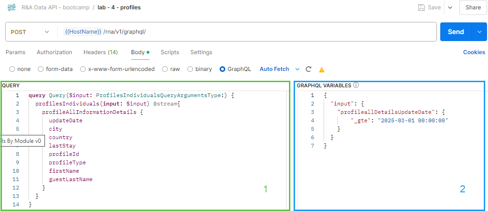
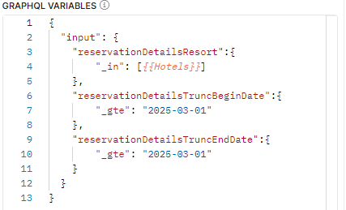
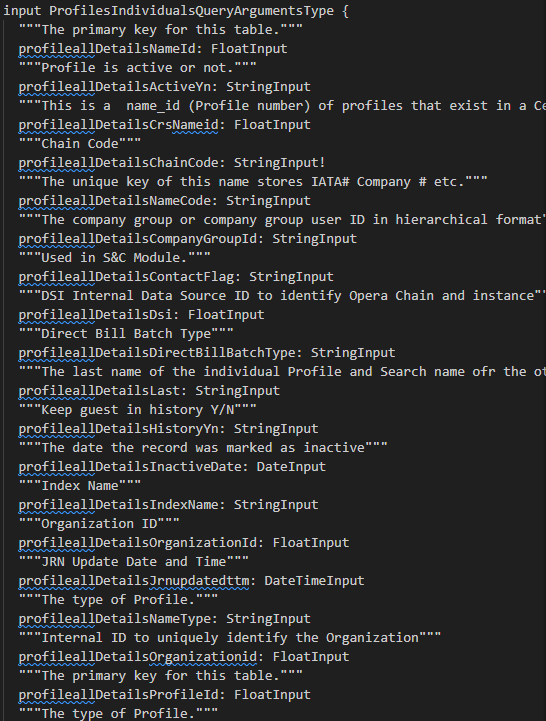
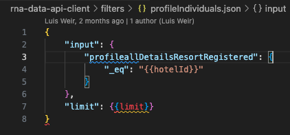
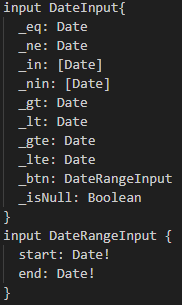
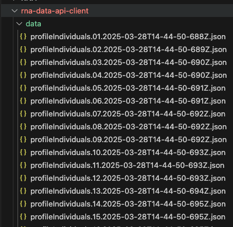
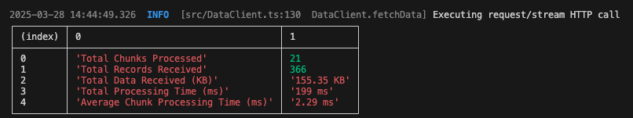

# R&A Data APIs Use Cases

- [R\&A Data APIs Use Cases](#ra-data-apis-use-cases)
  - [0 Introduction](#0-introduction)
    - [Objective](#objective)
  - [1 Setting up Postman](#1-setting-up-postman)
    - [Familiarizing yourself with using Postman for GraphQL](#familiarizing-yourself-with-using-postman-for-graphql)
    - [Responses in Postman](#responses-in-postman)
  - [2 Setting up the Client](#2-setting-up-the-client)
    - [Pre-Requisites](#pre-requisites)
    - [Installing the Client](#installing-the-client)
    - [Folder Structure for the Client](#folder-structure-for-the-client)
    - [Configure the Client](#configure-the-client)
    - [Queries](#queries)
    - [Filters and filter variables](#filters-and-filter-variables)
    - [Responses in the Client](#responses-in-the-client)
    - [Running the client](#running-the-client)
  - [3 Get Token](#3-get-token)
  - [4 Fetch Profiles](#4-fetch-profiles)
    - [4.1 Fetching Profiles Using Postman](#41-fetching-profiles-using-postman)
    - [4.2 Fetching Profiles Using the Client (optional)](#42-fetching-profiles-using-the-client-optional)
  - [5 Fetch Reservations](#5-fetch-reservations)
    - [5.1 Fetching Reservations Using Postman](#51-fetching-reservations-using-postman)
    - [5.2 Fetching Reservations Using the Client](#52-fetching-reservations-using-the-client)
  - [6 Fetch Transaction Details](#6-fetch-transaction-details)
    - [6.1 Fetching Transactions Using Postman](#61-fetching-transactions-using-postman)
    - [6.2 Fetching Transactions Using the Client](#62-fetching-transactions-using-the-client)

## 0 Introduction

In this bootcamp, we will go through the usage of R&A Data APIs to fetch data using streaming technologies from your R&A platform.

The R&A Data APIs use GraphQL, which is a powerful query language.  Unlike traditional REST APIs, GraphQL provides a flexible and structured way to fetch data, allowing clients to specify precisely what information they need.

You create queries, selecting fields and nested objects from a schema - the schemas are in the `rna_schemas` folder. These queries are then sent to the server, which returns a response in the exact shape requested, ensuring efficient data retrieval.

One of the key strengths of GraphQL is its ability to support complex queries with filters and parameters. You can apply filters to narrow down results, enabling advanced search functionality and custom data retrieval based on specific criteria.

### Objective

The goal of this lab is to become familiar with the Reporting & Analytics Data APIs (R&A Data APIs) both in Postman and in a sample Node based client.  You will learn how to:

- Use the schemas to build queries
- Set up and use Postman to call the R&A Data APIs
- Set up and use a Node based client to call the R&A Data APIs
- Query profile data, reservation data, and financial transactions

## 1 Setting up Postman

1. Download the [R&A Data APIs Postman collection in this repository](ra-data-apis---bootcamp.postman_collection.json) and import this to Postman
2. Ensure you have imported the [Bootcamp Reseller Postman environment in this repository](bootcamp-reseller.postman_environment.json)
3. Ensure the Bootcamp Reseller Postman environment is configured following this guide [Basic Setup](basic-setup.md).
4. Ensure the application key listed in the `AppKey` variable in the Postman environment is the application Oracle set up with access to the R&A Data APIs.

### Familiarizing yourself with using Postman for GraphQL

When using GraphQL for Postman there are some differences and some similarities with using Postman for REST APIs.

Just like with REST APIs you can use placeholders for variables that are in the Postman Environment selected, for example `{{hotelId}}`.

Unlike REST APIs the `Body` tab has a very different layout:

  

The green section marked `1` is the GraphQL query.  The response will include only the data in the query.  Postman offers typeahead for the query.

The blue section marked `2` is the filter.  This may be empty, but you can craft complex filters to limit the data returned.  There is also typeahead available for filters.  Furthermore, filters can incorporate variables from the Postman Environment, as in the below example which uses the Environment variable `{{Hotels}}`:

  

==NOTE:== Since Postman need to connect to the GraphQL server to check the schema, you must first have obtained a valid oAuth token before editing the queries or filters in Postman.

### Responses in Postman

You can visualize the multipart response in the `Raw` tab.  For ease of visualizing the results, a script pieces together the chunks into one JSON object; this can be seen in the `Visualization` tab.

## 2 Setting up the Client

Note that the [Node JS client](https://github.com/luisweir/rna-data-api-client) is for demonstration purposes only and is not meant to serve as a reference implementation.

The lab uses the demonstration node based client to invoke the R&A Data API and store the response into a file.

### Pre-Requisites

1. Git
2. Node

### Installing the Client

1. Clone or download the client code

```shell
git clone https://github.com/luisweir/rna-data-api-client
```

2. Install the node dependencies

```shell
cd rna-data-api-client
npm install
```

### Folder Structure for the Client

```text
rna-data-api-client
├── .env
├── data
│   └──<fetch_response>.json
├── filters
│   └──<filter_name>.json
├── queries
│   └──<query_name>.gql
└── src
```

### Configure the Client

1. Create a .env file if not present already

```shell
touch .env
```

2. Add the required config into .env file

   | Property | Description  |
   | -------- | ------------ |
   |`APIGW_URL`   | OHIP Gateway URL |
   |`APP_KEY`      | OHIP application key.  Ensure this is the application that Oracle set up with access to the R&A Data APIs. |
   |`CLIENT_ID`    | client_id to generate OAuth Token for Authentication |
   |`CLIENT_SECRET`| client_secret to generate OAuth Token for Authentication |
   |`ENTERPRISE_ID`| enterprise identifier related to the customer environment |
   |`EXCLUDE_NULL`| Set to true to remove null values from responses |
   |`PLUGIN_NAME`| Specifies which plugin should be used for processing data streams |
   |`QUERY_NAME`| File name for the query to be used while preparing the request|
   |`FILTER_NAME`| File name for the filter conditions to be used while preparing the request |
   |`FILTER_VARS`|Defines dynamic variables for filters. Takes comma separated variables with `key:value` format |
   |`ENABLE_PROXY`| Enable or Disable System Proxy for the request being Sent|

Example:

```shell
APIGW_URL=https://mucu1ua.hospitality-api.us-ashburn-1.ocs.oc-test.com
APP_KEY=****
CLIENT_ID=****
CLIENT_SECRET=****
ENTERPRISE_ID=OCR4ENT
EXCLUDE_NULL=true
PLUGIN_NAME=fileWriter
QUERY_NAME=profileIndividuals
FILTER_NAME=profileIndividuals
FILTER_VARS=hotelId:OHIPSB01,limit:100000
ENABLE_PROXY=false
```

Note that the values for the following change during the lab:

- `QUERY_NAME`
- `FILTER_NAME`
- `FILTER_VARS`

### Queries

Queries are stored in files in the "queries" folder.  When referencing queries in the `.env` file there is no need to include the `.gql` file extension.

Reference the schemas in the `rna_schemas` folder to build queries.

For example, the below excerpt from the [ProfilesIndividuals schema](rna_schemas/ProfilesIndividuals.graphql) shows just some of the fields available for inclusion in the query.



### Filters and filter variables

Filters are stored in files in the "filters" folder.  When referencing filters in the `.env` file there is no need to include the `.json` file extension.

Variables can be used in filters.  To create a place holder for a variable, insert the variable name in jinja template format. Example: `{{hotelId}}`.

For example, the variables `{{hotelId}}` and  `{{limit}}` are used in the below filter:

  

The values of variables are passed in the `.env` file as an array.  For example, `FILTER_VARS=hotelId:OHIPSB01,limit:100000` which means:

1. hotelId = OHIPSB01
2. limit = 100000

Reference the schemas in the `rna_schemas` folder to build filters.  The schema clarifies which operations are valid on which data.  For example in the below excerpt from the [ProfilesIndividuals schema](rna_schemas/ProfilesIndividuals.graphql) the only operations available on a `DateRangeInput` are `start` and `end`, both of which are dates.



### Responses in the Client

If the fileWriter plugin is selected (`PLUGIN_NAME=fileWriter` in the `.env`) the output of each response chunk is saved into individual json file in the data folder

   

Requests statistics such as the number of records, the number of chunks and time statistics can be seen in the output of the script.

Example:



### Running the client

After making the necessary configuration changes needed, run the script to fetch the data

```shell
npm start
```

## 3 Get Token

> NOTE: This is only required when using the Postman collection.  The client automatically obtains an oAuth token.

In Postman, expand the `R&A Data API - bootcamp` collection and click the `Get OAuth Token` request.

Click `Send`.

This automatically copies the token to the environment variable `Token`.

Scripts automatically obtain a new oAuth token when the token expires.

## 4 Fetch Profiles

This fetches the profiles you've modified during the OHIP Lab and stores them locally.

The query uses the Profile-Individuals Subject Area API.

### 4.1 Fetching Profiles Using Postman

Having first run the `Get OAuth Token` request click the request `lab - 4 - profiles`.  Then:

1. Create a new query file with whichever fields you want from the [ProfilesIndividuals schema](rna_schemas/ProfilesIndividuals.graphql) and typeahead
2. Create GraphQL variables that will return profiles updated in the last 3 days
3. Click `Send`

This query filters the Profile-Individuals Subject Area by the property you've been using as well as by their updated date.

### 4.2 Fetching Profiles Using the Client (optional)

Using the client:

1. Create a new query file with whichever fields you want from the [ProfilesIndividuals schema](rna_schemas/ProfilesIndividuals.graphql)
2. Create a filter file that will return profiles updated in the last 3 days
3. Update the `.env` file and run the query

*Tip* We recommend building the query in Postman then copying it into the saved query.

## 5 Fetch Reservations

Here you will be fetching the reservations you've created during the OHIP Lab and store them locally.

For this, you'll use the Booking-Reservation Subject Area API.

### 5.1 Fetching Reservations Using Postman

Having first run the `Get OAuth Token` request click the request `lab - 5 - reservations`.  Then:

1. Create a new query file with whichever fields you want from the [BookingsReservation schema](rna_schemas/BookingsReservation.graphql) and typeahead
2. Create GraphQL variables that will return reservations for hotel OHIPSB01 in the last 3 days
3. Click `Send`

This query filters the Booking-Reservation Subject Area by the property you've been using as well as by the reservations' updated date.

### 5.2 Fetching Reservations Using the Client

Using the client:

1. Create a new query file with whichever fields you want from the [BookingsReservation schema](rna_schemas/BookingsReservation.graphql)
2. Create a filter file that will return reservations for hotel OHIPSB01 in the last 3 days
3. Update the `.env` file and run the query

*Tip* We recommend building the query in Postman then copying it into the saved query.

## 6 Fetch Transaction Details

Here you will be fetching the transactions you've created during the OHIP Lab and store them locally.

For this, you'll use the Financial-TransactionDetails Subject Area API.

### 6.1 Fetching Transactions Using Postman

Having first run the `Get OAuth Token` request click the request `lab - 6 - transactions`.  Then:

1. Create a new query file with whichever fields you want from the [FinancialTransactionDetails schema](rna_schemas/FinancialTransactionDetails.graphql) and typeahead
2. Create GraphQL variables that will return financial transactions for any of the hotels OHIPBSB01, OHIPSB01, or OHIPSB03 yesterday
3. (Optional) Extend the GraphQL variables to return only financial transactions for a given reservation and business date
4. Click `Send`

This query filters the Financial-TransactionDetails Subject Area by their business and transaction dates.

### 6.2 Fetching Transactions Using the Client

Using the client:

1. Create a new query file with whichever fields you want from the [FinancialTransactionDetails schema](rna_schemas/FinancialTransactionDetails.graphql)
2. Create a filter file that will return financial transactions for any of the hotels OHIPSB01, OHIPSB02, or OHIPSB03 yesterday
3. (Optional) Extend the filter to return only financial transactions for a given reservation and business date
4. Update the `.env` file and run the query

*Tip* We recommend building the query in Postman then copying it into the saved query.
