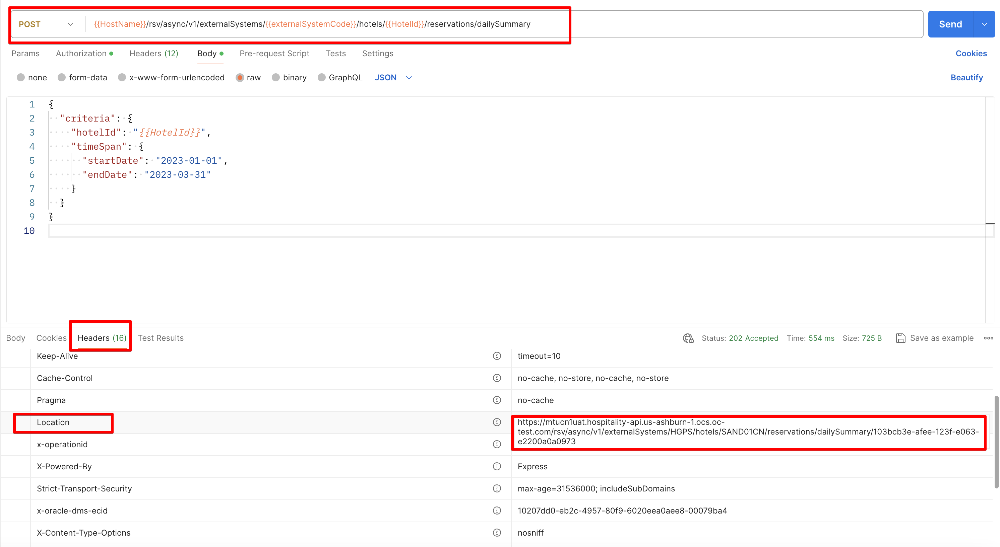
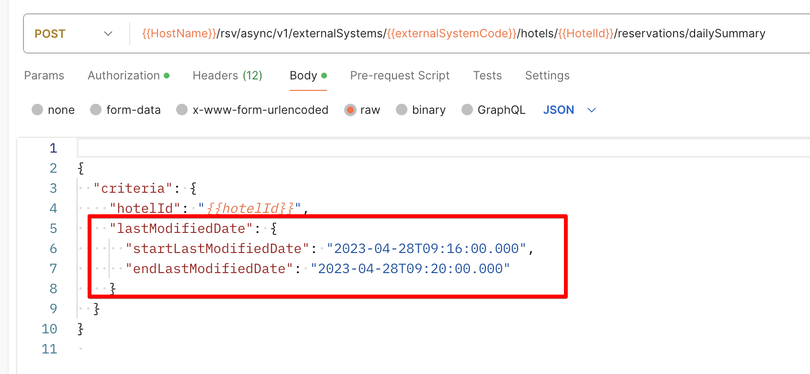
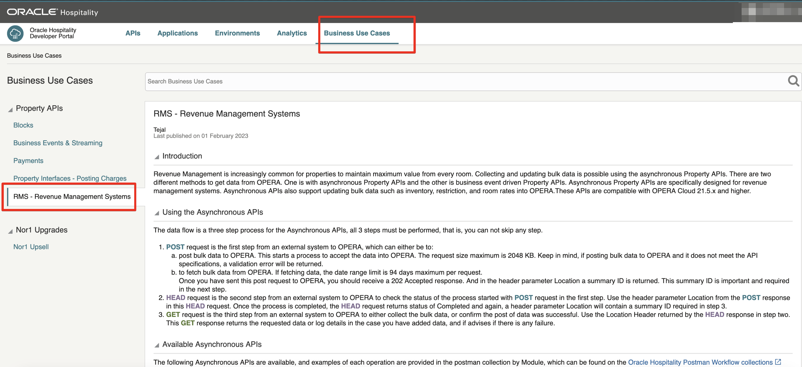

# Async

For long-running operations such as adding, updating, or retrieving large amounts of data, there is a series of Oracle Hospitality Property APIs called asynchronous ("Async") APIs.

1. [How to call Async APIs](#1-how-to-call-async-apis)
2. [How frequently should I send HEAD?](#2-how-frequently-should-i-send-head)
3. [When will the response be available?](#3-when-will-the-response-be-available)
4. [Async APIs call limits](#4-async-apis-call-limits)
5. [Async APIs](#5-async-apis)
6. [Async APIs Size Limits](#6-async-apis-size-limits)
7. [Creating an External System in OPERA Cloud](#7-creating-an-external-system-in-opera-cloud)
8. [Business Use Cases](#8-business-use-case)
9. [Upcoming Async APIs](#9-upcoming-async-apis)
10. [Async Lab](#10-async-lab)

## 1. How to call Async APIs

For Async APIs the data flow is a three step process. All 3 steps must be performed, that is, you cannot skip any step.

a. **POST**  request is the first step from an external system to OPERA Cloud, which can either be to:

* post bulk data to OPERA Cloud.  This starts a process to accept the data into OPERA Cloud. The request size maximum is 2048 KB.  Keep in mind, if posting bulk data to OPERA Cloud and it does not meet the API specifications, a validation error will be returned.
* to fetch bulk data from OPERA Cloud.  If fetching data, there may be a date limit range.

Once you have sent this post request to OPERA Cloud, you should receive a 202 Accepted response.  And in the header parameter Location a summary ID is returned.  This summary ID is important and required in the next step.

* Kindly note that you can do maximum of 150 requests per minute per application

* 30 minutes interval if same dates are present in the payload



b. **HEAD** request is the second step from an external system to OPERA Cloud to check the status of the process started with POST request in the first step. Use the header parameter Location from the POST response in this HEAD request.  Once the process is completed, the HEAD request returns status of Completed and again, a header parameter Location will contain a summary ID required in step 3.

Consider multiple `HEAD` retries for large data before finally sending the GET request.

c. **GET** request is the third step from an external system to OPERA Cloud to either collect the bulk data, or confirm the post of data was successful. Use the Location Header returned by the HEAD response in step two. This GET response returns the requested data or log details in the case you have added data, and if advises if there is any failure.

## 2. How frequently should I send HEAD?

Recommendation is to wait 1-2 minutes before sending HEAD request after Post

Since OPERA Cloud 24.1 HEAD requests return a header `retry-after` containing the number of seconds we recommend waiting before calling HEAD again.

## 3. When will the response be available?

There is no set length of time; different requests require different amounts of processing, and operational use of OPERA Cloud will affect the speed of responding to the request.

## 4. Async APIs call limits

A maximum of 120 requests per minute per application can be made to the Async API. Bear this in mind when determining how frequently to poll HEAD.
___

In the operation `startReservationsDailySummaryProcess` in the OPERA Cloud Reservation Asynchronous API a request that uses the parameter `lastModifiedDate` (available from OPERA Cloud 23.1) can be called only once every 3 hours.
A given request body can be called only once every 30 minutes when starting an Asynchronous API request.


___

If partner requests data with `startDate` and `endDate` and a duplicate request (having same criteria) is sent within 30 minutes the following response is received:
```Identical request was received 0 minutes ago. Please allow at least 30 minutes between asynchronous requests.```
___

If partner requests data with `startLastModifiedDate` & `endLastModifiedDate`; irrespective of whether the subsequent request is duplicate or new, the partner will not be able to request the data again for the next 3 hours. This is intended behavior. The thought process is no one should use `LastModifiedDate` criteria more frequently than 3 hrs because it is very heavy on database.
___

Since OPERA Cloud 24.1 HEAD requests return a header `retry-after` containing the number of seconds we recommend waiting before calling HEAD again.
___

Messages are available for 6 hours in the queue.
___

## 5. Async APIs

* ReservationDailySummary
* BlockAllocationSummary
* RevenueInventoryStatistics
* SellLimits
* RestrictionProcess
* BestAvailableRatePlans
* DailyRatePlanSchedules
* HurdleRates
* RatePlanHeaders

Fetch Data from OPERA Cloud:

* getReservationDailySummary
* getBlockAllocationSummary
* getRevenueInventoryStatistics

Others are for Posting Data to OPERA Cloud

## 6. Async APIs Size Limits

Each API has 2 MB size limit.

For example if you want to update Daily Rates using `DailyRatePlanSchedules` the maximum content in the body should be size of 2MB.

## 7. Creating an External System in OPERA Cloud

Please follow [this guide](https://docs.oracle.com/en/industries/hospitality/integration-platform/ohipu/t_polling_api.htm#PollingAPIpull-170089A2) to see how an External System is created in OPERA Cloud which is required for Async APIs.

If your application is subscribed to the Streaming API you can also fetch Async APIs using the external system code displayed on the Application > Events > Subscribed tab in the Developer Portal.

## 8. Business Use Case

To find more information on Async APIs, please navigate to your developer portal and under the tab `Business Use Cases` you will find more information.



## 9. Upcoming Async APIs

* Mass Update Reservations - Target OPERA Cloud 24.1
* Stay records - Target OPERA Cloud 24.2
* Tax breakdown n Reservation Daily Summary Response - Target OPERA Cloud 24.5

## 10. Async Lab

1. Ensure the environment selected is "Bootcamp Reseller".
2. Set the `ExtSystemCode` parameter to the external system code provided to you by the Oracle team.

### Send the first request

1. In Postman expand the `1. Property REST APIs By Module` collection, then expand the folder `Asynchronous APIs`, then expand the folder `Reservation (RSVASYNC)`.
2. Click the request `start Reservations Daily Summary Process`
3. Click the `Body` tab and change the dates in the payload to the below
4. Send the request
5. Open the console, click the request, and scroll down to the Response Headers.  Highlight the last part of the URL in the `Location` header and choose `Set:Bootcamp Reseller` then choose `SummaryId`

``` json
{
  "criteria": {
    "hotelId": "{{HotelId}}",
    "timeSpan": {
      "startDate": "2024-01-02",
      "endDate": "2024-03-31"
    }
  }
}
```

### Send the second request

1. In Postman expand the `1. Property REST APIs By Module` collection, then expand the folder `Asynchronous APIs`, then expand the folder `Reservation (RSVASYNC)`.
2. Click the request `get Reservations Process Status`
3. Send the request
4. Look in the Console to see the response headers
5. If the `status` header is `COMPLETED` then:

a. Highlight the last part of the URL in the `Location` response headerand choose `Set:Bootcamp Reseller` then choose `SummaryId`
b. Proceed to send the third request

### Send the third request

1. In Postman expand the `1. Property REST APIs By Module` collection, then expand the folder `Asynchronous APIs`, then expand the folder `Reservation (RSVASYNC)`.
2. Click the request `get Reservations Daily Summary`
3. Send the request
