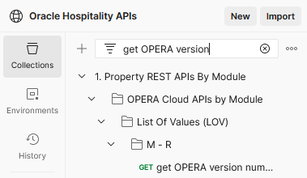

# Basic Setup

Getting started with Oracle Hospitality Integration Platform is easy.  Follow these steps.

1. [Accessing the Developer Portal](#1-accessing-the-developer-portal)
2. [Understanding the Developer Portal](#2-understanding-the-developer-portal)
3. [Obtaining Credentials](#3-obtaining-credentials)
4. [Authentication Flows](#4-authentication-flows-background)
5. [Setting up Postman](#5-setting-up-postman)
6. [Obtaining an oAuth Token](#6-obtaining-an-oauth-token)
7. [Calling the getHotelDetails API](#7-calling-the-gethoteldetails-api)
8. [Finding the OPERA version of the environment](#8-finding-the-opera-version-of-the-environment-optional)
9. [Analytics](#9-view-analytics)

## 1. Accessing the Developer Portal

1. Create a Developer Portal user.  See [Adding Developer Portal Users](https://docs.oracle.com/en/industries/hospitality/integration-platform/ohipu/t_getting_started_for_partners.htm#OHIPU-AddingUsers-3E28413A)
2. Assign the `ApplicationDeveloper` role to the Developer Portal user.  See [Assigning Users to Roles](https://docs.oracle.com/en/industries/hospitality/integration-platform/ohipu/t_getting_started_for_partners.htm#OHIPU-AssigningUsersToRoles-879F91FD)
3. Sign in to the Oracle Hospitality Developer Portal.  See [Signing In to the Oracle Hospitality Developer Portal](https://docs.oracle.com/en/industries/hospitality/integration-platform/ohipu/t_getting_started_for_partners.htm#OHIPU-SigningInToTheDeveloperPortal-DC32FEE5)

## 2. Understanding the Developer Portal

### 2a. Finding APIs and workflows (optional)

These steps are *optional* but familiarize you with finding APIs in the Developer Portal.

1. Searching for the Enterprise Configuration API.  See [API Search Engine](https://docs.oracle.com/en/industries/hospitality/integration-platform/ohipu/ch_discover_and_subscribe_to_APIs.htm#OHIPU-APISearchEngine-3C569607)
2. View the API specifications for the V1 Enterprise Configuration API
3. Search for the operation `getHotelDetails`
4. Find the example request in Postman for `getHotelDetails` 
5. Find the workflow for checking in

### 2b. Creating an application

1. Create an application and subscribe it to the Property APIs.  See [Registering an Application](https://docs.oracle.com/en/industries/hospitality/integration-platform/ohipu/c_register_and_manage_applications.htm#OHIPU-CreatingAnApplication-D59E4A5D).  Note down the Application Key.

## 3. Obtaining credentials

In this lab, we are using an environment on the Client Credentials grant as the environment is on OCIM (OPERA Cloud Identity Manager). Every partner already has access to this sandbox.  If you don't already have the environment follow these instructions:

### 3b. Adding environment

1. On the Environments page click `Add Environment`, choosing the `Enterprise ID` tab and entering the Enterprise Id and chain code supplied to you by Oracle. The region is Ashburn and the environment type is Non Production.
2. Inform the Oracle team who will approve the connection.
3. Once the environment shows `Approved` click `View Details` and note down the gateway URL and clientId.
4. Click `Reissue` to create the clientSecret and jot this down.

## 4. Authentication Flows (background)

Oracle Hospitality APIs are protected by oAuth2.  There are two "flows" used in Oracle Hospitality APIs: Client Credentials, and Resource Owner.  These flows refer to which credentials are needed to obtain an oAuth token.  In this lab we're using an environment on the Client Credentials grant.

## 5. Setting up Postman

1. Download the latest Postman collections and the [Postman Environment](https://github.com/oracle/hospitality-api-docs/blob/main/postman-collections/oracle-hospitality-property.postman_environment.json) from the [Oracle Hospitality Github repository](https://github.com/oracle/hospitality-api-docs/tree/main/postman-collections)
2. Download the [Bootcamp Postman collection in this repository](Bootcamp_Reseller.postman_collection.json)
3. Download the [Bootcamp Postman environment in this repository](Bootcamp_Reseller.postman_environment.json)
4. Import these Postman collections and Environment into Postman
5. In the Postman Environment fill in the below details:

| **Variable Name** | **Value** |
| --- | --- |
| AppKey | Application key you noted down in [Creating an application](#2b-creating-an-application) |
| CLIENT_ID | ClientId obtained from the Environment card in [Obtaining Credentials](#3-obtaining-credentials) |
| CLIENT_SECRET | ClientSecret obtained from the Environment card in [Obtaining Credentials](#3-obtaining-credentials) |
| HostName | Gateway URL obtained from the Environment card in [Obtaining Credentials](#3-obtaining-credentials) |
| HotelId | Value supplied by the Oracle team.  This is already filled in for the Bootcamp environment |
| EnterpriseId | `EnterpriseId` used to Add Environment in [Credentials](#3-obtaining-credentials) |

## 6. Obtaining an oAuth token

1. Expand the "Bootcamp" collection, inside the "Implementation Use Cases" folder
2. Click the saved request `01. Get oAuth Token`
3. Click Send
4. Note that this populates the variable `Token` in the Postman environment with the value `access_token` returned in the response

## 7. Calling the getHotelDetails API

1. Search for the getHotelDetails saved request in Postman (it's in the "Property REST APIs by Module" collection in the folder "OPERA Property APIs by Module" > "Enterprise Configuration (ENT Config)").  *Note* for ease of reading, operationIds are separated by spaces, thus `getHotelDetails` appears as `get Hotel Details` 
2. Click Send.  This works because it uses the oAuth token in the Postman Environment

## 8. Finding the OPERA version of the environment (Optional)

1. Search for the `get OPERA version` saved request in Postman (it's in the "Property REST APIs by Module" collection in the folder "List of Values (LOV)" > "M-R") 
2. Click Send.  Read the `operaVersion` from the response payload

## 9. View analytics

1. Go back to the Developer Portal and click on the Analytics tab.  See [Analytics](https://docs.oracle.com/en/industries/hospitality/integration-platform/ohipu/c_analytics.htm#OHIPU-Analytics-EC725F0D)
2. See the calls made just now in the analytics
3. Filter down to the Enterprise Configuration API to see just the calls we made to `getHotelDetails`, along with any other operations we called in the Enterprise Configuration API
