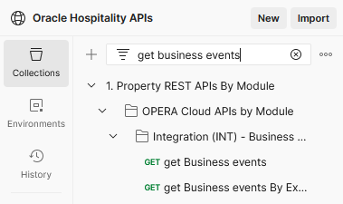
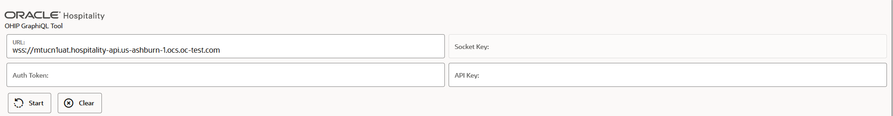
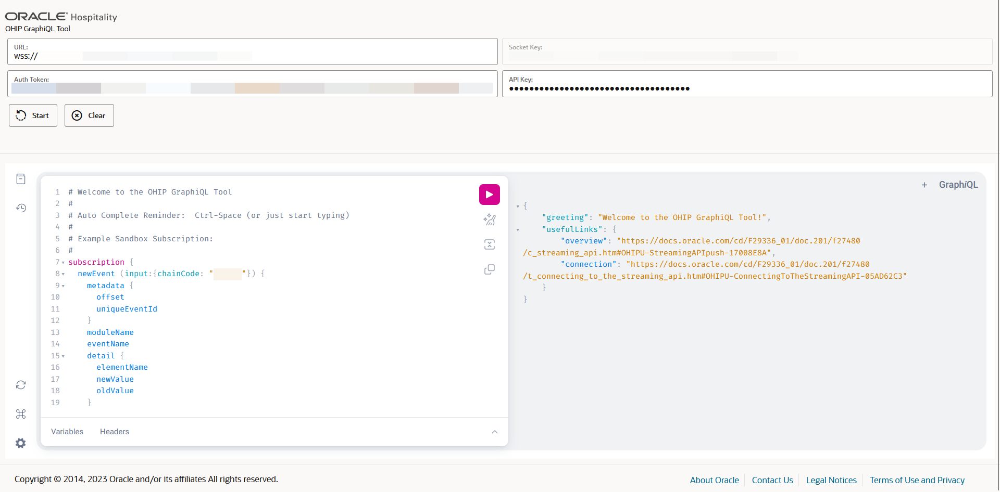

# Business Events

[Polling](#polling)

1. [Creating an External System in OPERA Cloud](#1-creating-an-external-system-in-opera-cloud)
2. [Configuring an External System for Events](#2-configuring-the-external-system-for-events)
3. [Calling the getBusinessEvents API](#3-calling-the-getbusinessevents-api)

[Streaming Lab](#streaming-lab)

1. [Configure Streaming in the Developer Portal](#1-configure-streaming-in-the-developer-portal)
2. [Use Postman to stream events](#2-use-postman-to-stream-events)
3. [Use GraphiQL to stream events - Optional](#3-use-graphiql-to-stream-events---optional)
4. [Use the NodeJS reference implementation to stream events - Optional](#4-use-the-nodejs-reference-implementation-to-stream-events-optional)

## Polling

Polling means sending repeated requests to ask "are there any events for my external system".  Polling is configured in OPERA Cloud.

### 1. Creating an External System in OPERA Cloud

#### 1.1 Creating the user

1. Create a chain-level user in OPERA Cloud
2. Assign the following tasks to the user.  See [Assigning Tasks to a Role](https://docs.oracle.com/search/?q=Assigning+Tasks+to+a+Role&category=industries&product=en%2Findustries%2Fhospitality):

* Under Interfaces Admin - Property Interfaces - External Systems: _New/Edit External Systems_
* Under Interfaces Admin - Property Interfaces - Business Events: _New/Edit Business Events_

#### 1.2 Creating an external system

1. Create an external system in OPERA Cloud following [these steps](https://docs.oracle.com/search/?q=Configuring%20External%20Systems&pg=1&size=10&product=en%2Findustries%2Fhospitality&category=en%2Findustries&showfirstpage=true&lang=en). Tick the `Auto Configure External Databases` checkbox. Note down the external system code.

### 2. Configuring the External System for Events

1. Choose which events to receive using [this guide to the list of business events and the Data Elements - fields - on them](https://docs.oracle.com/cd/E98457_01/opera_5_6_core_help/PDFs/Business%20Events%20Data%20Elements_5%200.pdf).  For this workshop choose the events `Create Profile`, `Update Profile`, and `Update Reservation`
2. Add events to the external system by [configuring business events](https://docs.oracle.com/search/?q=Configuring%20External%20Systems&pg=1&size=10&product=en%2Findustries%2Fhospitality&category=en%2Findustries&showfirstpage=true&lang=en) in OPERA Cloud

### 3. Calling the getBusinessEvents API

1. Verify the details in the Postman Environment file (see the "Basic Setup" workshop)
2. Obtain an oAuth token (see the "Basic Setup" workshop)
3. In the Postman collection find the operation `get Business Events`



4. Click Send and observe that up to 20 events are received
5. Generate some events by calling the `post Profile` operation
6. Call the `get Business Events` operation again to observe the event arrive for the new profile created

## Streaming Lab

Streaming means opening a WebSocket connection, then Oracle Hospitality pushing events on that connection as they occur.  Streaming is configured in the Oracle Hospitality Integration Platform Developer Portal.

### 1. Configure Streaming in the Developer Portal

1. On the developer portal Environments tab, add the environment provided by the Oracle team (see the "Basic Setup" workshop)
2. Verify that the environment shows the `Streaming Enabled` label
3. Open an application from the Applications tab
4. Add the events `Create Profile`, `Update Profile`, and `Update Reservation` to the template.  See [Working with Events in the Developer Portal](https://docs.oracle.com/en/industries/hospitality/integration-platform/ohipu/c_streaming_api.htm#OHIPU-WorkingWithEventsInTheDeveloperPort-0BDD2493)


5. Go to the Application > Events > Subscribed tab and subscribe to consume events from the environment provided by the Oracle team
6. Verify that the events listed are the same as those on the template
7. Notify the Oracle team to approve the subscription.  In production, this would be approved by the hoteliers.

### 2. Use Postman to stream events

1. Sign in to Postman.com
2. Fork [this collection](https://www.postman.com/hospitalityapis/workspace/oracle-hospitality-apis/collection/64e77a3c0d2905380767b08e) to your own user
3. Verify the values in the Postman environment match: The application subscribed to the events in [Configure Streaming in the Developer Portal](#1-configure-streaming-in-the-developer-portal); the gateway URL, clientId, and clientSecret of the environment given by the Oracle team
4. Obtain an oAuth token (see the "Basic Setup" workshop)
5. Edit the `subscribe` message to have the `chainCode` given to you by the Oracle team
6. Open the "Saved Messages" on the right of the request
7. Send the `init` message


8. Send the `subscribe` message within 5 seconds of sending the `init` message
9. Observe events flowing through
10. In the `1. Property REST APIs By Module` collection expand the `OPERA Cloud REST APIs By Module` folder, then the `Profiles (CRM)` folder, then the `Post Profile (create)` folder, open the `Post Profile` request and click Send a few times.
11. In the `1. Property REST APIs By Module` collection expand the `OPERA Cloud REST APIs By Module` folder, then the `Profiles (CRM)` folder, then the `Put Profile (update)` folder, open the `Put Profile` request and click Send a few times
12. Keep sending the `ping` request to keep the connection open
13. Send the `complete` request to close the connection

### 3. Use GraphiQL to stream events - Optional

1. Download the [GraphiQL page from the Oracle Hospitality Github repository](https://github.com/oracle/hospitality-api-docs/blob/main/graphql/graphiql.html)
2. Open the GraphiQL HTML page



3. Obtain an oAuth token (see the "Basic Setup" workshop) using the clientId, clientSecret, and gateway URL of the environment given by the Oracle team
4. Paste the value of the `access_token` to the `Auth Token` field
5. Enter the Gateway URL in the `URL` field, but change the scheme from `https://` to `wss://`  (see the "Basic Setup" workshop for obtaining the Gateway URL)
6. Enter the application key in the `Application Key` field  (see the "Basic Setup" workshop for obtaining the application key).  Use the application subscribed to consume events from the environment supplied by the Oracle team - see [Configure Streaming in the Developer Portal](#1-configure-streaming-in-the-developer-portal)
7. Click Start
8. In the request payload ensure the `chainCode` reflects the tenant code given to you by the Oracle team



9. _Optional_ Open developer tools in the browser and go to the "Network" tab, filtering this for `WS` (WebSocket traffic) and clicking the "Response" tab
10. Click Play.  Observe the `subscribe` event being sent, followed by events flowing through
11. In the `1. Property REST APIs By Module` collection expand the `OPERA Cloud REST APIs By Module` folder, then the `Profiles (CRM)` folder, then the `Post Profile (create)` folder, open the `Post Profile` request and click Send a few times.
12. In the `1. Property REST APIs By Module` collection expand the `OPERA Cloud REST APIs By Module` folder, then the `Profiles (CRM)` folder, then the `Put Profile (update)` folder, open the `Put Profile` request and click Send a few times
13. Click Stop to close the WebSocket connection.  Observe the `complete` message sent and the `Connection Closed: 1000` response

### 4. Use the NodeJS reference implementation to stream events (Optional)

#### 4.1 Prerequisites for using the NodeJS reference implementation

1. Visual Studio Code or another IDE
2. UNIX or bash client (or similar like zsh)

#### 4.2 Clone repo and install software

1. Fork [this repository](https://github.com/luisweir/streaming-client)
2. Open Visual Studio Code or another IDE that has a Unix or bash client built in
3. Clone your fork to your local machine
4. _Recommended_ Install Node Version Manager, especially if you run multiple versions of Node on your machine following the guidance in the [readme file](https://github.com/luisweir/streaming-client/blob/main/README.md).  It is particularly important to carry out [this step](https://github.com/nvm-sh/nvm#nvmrc)
5. Install Node as described in the readme file
6. Check that TypeScript is installed as described in the readme file
7. Install the NodeJS reference implementation as described in the readme file

#### 4.3 Configure the client

1. Follow the section on configuring listed in the [readme file](https://github.com/luisweir/streaming-client/blob/main/README.md), copying the environment variables section to the `.env` file
2. In the `.env` file fill in the details of the streaming enabled environment (`APIGW_URL`, `WS_URL`, `CLIENT_ID`, `CLIENT_SECRET`, and `CHAIN`)
3. In the `.env` file fill in the details of the integration user (`INTEGRATION_USER`, `INTEGRATION_PASSWORD`)
4. In the `.env` file fill in the details of the application (`APP_KEY`)

#### 4.4 Run the client

```bash
    npm start
```

1. In the `1. Property REST APIs By Module` collection expand the `OPERA Cloud REST APIs By Module` folder, then the `Profiles (CRM)` folder, then the `Post Profile (create)` folder, open the `Post Profile` request and click Send a few times.
2. In the `1. Property REST APIs By Module` collection expand the `OPERA Cloud REST APIs By Module` folder, then the `Profiles (CRM)` folder, then the `Put Profile (update)` folder, open the `Put Profile` request and click Send a few times
3. Observe the Business Events flowing through.
